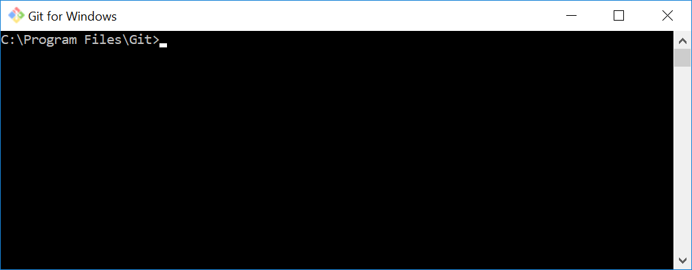

# PowerShell basic scripts 
Some PowerShell basic scripts to learn more 'why'. Illustrates some environment specifics and nuances about the language. 

# Clone the repository
Get a local copy of the scripts, best if opened with PowerShell IDE (Integrated Development Environment)

1. Click on 'PowerShellStorage' (The blue bread crumb link tkmyers46/PowerShellStorage)
2. Click 'Clone or download' (Green button)
3. Click the clipboard icon next to the url https://github.com/tkmyers46/PowerShellStorage.git
4. Paste that URL into Visual Studio or use Git Command Line
5. [Install Git.](https://git-scm.com/downloads) Instructions for cloning are below under 'Git for Windows'
6. You should have a git application that looks like this...

6. After installing git, paste this into your git command shell: ```git clone https://github.com/tkmyers46/PowerShellStorage.git```
7. You should now have a folder 'PowerShellStorage' with the folders and scripts

# Git for Windows
[Download Git](https://git-scm.com/downloads)
- [How do I 'clone' a repository?](https://git-scm.com/book/en/v2/Git-Basics-Getting-a-Git-Repository)
- [Clone a repository in Visual Studio](https://docs.microsoft.com/en-us/azure/devops/repos/git/clone?view=vsts&tabs=visual-studio)

# Contribute
Add or correct the comments in the scripts, or create your own.
- [Visual Studio Code](https://github.com/Microsoft/vscode)
